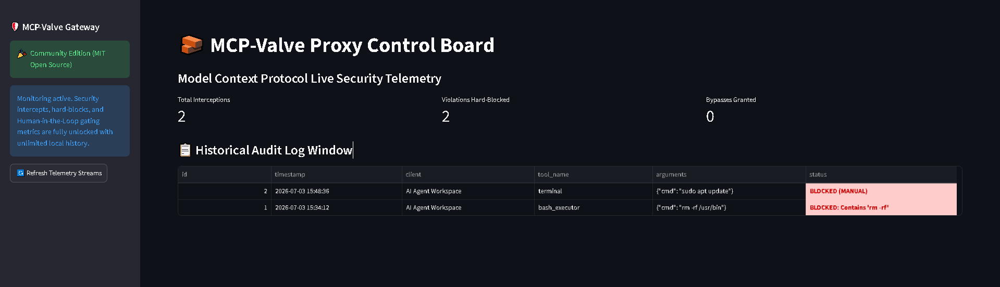

# 🛡️ MCP-Valve Proxy

A high-integrity control valve and security gateway proxy designed to intercept, audit, and validate Model Context Protocol (MCP) tool execution pipelines in real time.

Designed for security-conscious developers, compliance teams, and enterprises to help prevent autonomous agents (e.g., Cursor, Claude Code, and desktop extensions) from executing unauthorized terminal commands, exposing sensitive data, or performing destructive operations.

---

## 🚀 Key Features

- **Stream Interception Engine**  
  Evaluates JSON-RPC packets on standard I/O communication channels before execution.

- **Dynamic Policy Firewall**  
  Restricts risky operations through a customizable local `policies.yaml` configuration.

- **Interactive Approval Gates**  
  Pauses high-risk actions and requires human approval before execution.

- **Immutable Audit Trails**  
  Stores runtime telemetry and security events in a local SQLite database.

---

## 📸 Dashboard Preview

> Add a screenshot of your Streamlit dashboard here after uploading it to the repository.

```markdown

```

---

## 📦 Tech Stack

| Component | Technology |
|-----------|-------------|
| Core Runtime | Python 3.12+ |
| Protocol Layer | JSON-RPC |
| Policy Engine | YAML |
| Database | SQLite |
| Dashboard | Streamlit |
| Data Processing | Pandas |

---

## 📥 Download & Installation

### Community Edition

Download the latest release from:

https://github.com/YOUR_GITHUB_USERNAME/mcp-valve/releases

> The community edition may include feature limitations such as reduced log visibility or evaluation-only functionality, depending on your distribution model.

### Enterprise Edition

If you plan to offer commercial licensing, replace the placeholder below with your official storefront link:

**Enterprise Licensing:**  
YOUR_LEMON_SQUEEZY_PRODUCT_LINK

Enterprise features may include:

- Unlimited audit log retention
- Advanced policy rules
- Multi-user workflows
- Organizational compliance controls
- Priority support

---

## ⚙️ Configuration (`policies.yaml`)

Customize protection policies by defining blocked and approval-required keywords:

```yaml
blocked_keywords:
  - "rm -rf"
  - "drop table"
  - "delete from"

pending_keywords:
  - "sudo"
  - "install"
  - "apt-get"
```

---

## 🛠️ Local Development

### Clone the Repository

```bash
git clone https://github.com/YOUR_GITHUB_USERNAME/mcp-valve.git
cd mcp-valve
```

### Install Dependencies

```bash
python -m uv pip install -r requirements.txt
```

### Launch the Dashboard

```bash
python -m uv run streamlit run app.py
```

### Test a Sample Payload

```bash
echo "{\"jsonrpc\":\"2.0\",\"method\":\"tools/call\",\"params\":{\"name\":\"bash_executor\",\"arguments\":{\"cmd\":\"rm -rf /usr/bin\"}},\"id\":1}" | python proxy.py
```

---

## 📂 Project Structure

```text
mcp-valve/
├── app.py
├── proxy.py
├── policies.yaml
├── requirements.txt
├── .gitignore
└── README.md
```

---

## 📄 License

This project is distributed under the **MCP-Valve Commercial & Non-Commercial License**.

- Free for personal, educational, and non-commercial use.
- Commercial deployment or enterprise integration may require a valid commercial license, depending on your chosen business model.

See the `LICENSE` file for complete terms.